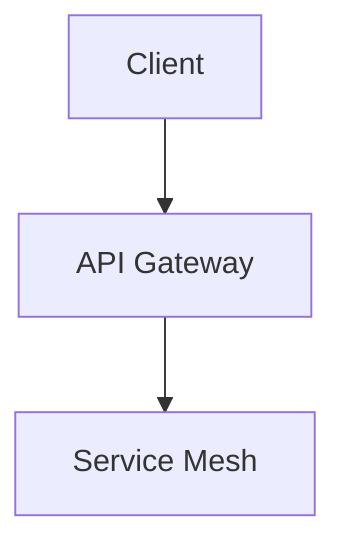

# Technical Document Title

**Version:** 1.2.0  
**Last Updated:** 2026-05-25  
**Status:** Draft / Approved / Deprecated

## Table of Contents

- [1. Introduction](#1-introduction)
- [2. Architecture Overview](#2-architecture-overview)
- [3. Detailed Design](#3-detailed-design)
- [4. Implementation Notes](#4-implementation-notes)
- [5. Testing Strategy](#5-testing-strategy)
- [6. Deployment](#6-deployment)
- [7. References](#7-references)

## 1. Introduction

Provide context, goals, and scope of this document.

> [!IMPORTANT]
> This document is the single source of truth for the X system architecture.

## 2. Architecture Overview

High-level diagram description or ASCII art / Mermaid if supported.



## 3. Detailed Design

### 3.1 Component X

| Component | Responsibility                  | Technology     | Owner      |
| --------- | ------------------------------- | -------------- | ---------- |
| Auth      | JWT validation & user sessions  | Rust + Axum    | @security  |
| Data      | Persistent storage layer        | PostgreSQL 16  | @data-team |

### 3.2 Data Flow

1. Request arrives at ...
2. ...

## 4. Implementation Notes

```rust
// Example code block with language
#[tokio::main]
async fn main() {
    println!("GFM-ready documentation");
}
```

~~Legacy approach~~ — use the new async runtime instead.

## 5. Testing Strategy

- Unit tests: ...
- Integration tests: ...
- Performance benchmarks: ...

## 6. Deployment

Use the standard CI/CD pipeline. See `docs/deployment.md`.

## 7. References

- [GFM Spec](https://github.github.com/gfm/)
- Internal RFC-042: "Markdown as Code"

---

*This document follows the GFM Markdown skill standards for maximum readability on GitHub.*